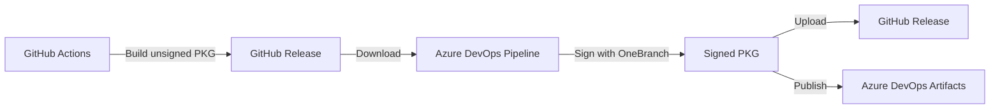

# Azure DevOps Setup Guide for Azure CLI macOS PKG Signing

## Overview

This guide will help you set up Azure DevOps to sign macOS PKG files that were built by GitHub Actions. This is a **hybrid approach** that allows you to:

1. ✅ Build PKGs in GitHub Actions (existing workflow)
2. ✅ Sign PKGs using Azure DevOps with OneBranch/ESRP
3. ✅ Optionally upload signed PKGs back to GitHub releases

## Prerequisites

### 1. Azure DevOps Organization
- [ ] Access to an Azure DevOps organization
- [ ] Permissions to create pipelines and variable groups
- [ ] OneBranch access (Microsoft internal requirement)

### 2. GitHub Integration
- [ ] GitHub Personal Access Token (PAT) with `repo` scope
- [ ] Access to your GitHub repository releases

### 3. Signing Certificates
- [ ] Access to Microsoft ESRP signing service
- [ ] `KeyCode` for macOS package signing (MacAppDeveloperSign)
- [ ] Variable group: `mscodehub-macos-package-signing`

## Setup Steps

### Step 1: Create Variable Groups

#### A. GitHub Integration Variable Group

1. Go to Azure DevOps → Pipelines → Library
2. Click "+ Variable group"
3. Name: `github-integration`
4. Add variables:
   ```
   Variable Name: GITHUB_PAT
   Value: <your-github-personal-access-token>
   Secret: ✅ (check this box)
   ```

#### B. macOS Signing Variable Group

This should already exist in your organization if you have OneBranch access:
- Name: `mscodehub-macos-package-signing`
- Contains: `KeyCode` variable for macOS signing

If it doesn't exist, contact your OneBranch/ESRP administrator.

### Step 2: Configure OneBranch Repository Reference

The pipeline uses OneBranch templates. Ensure you have access:

```yaml
resources:
  repositories:
  - repository: onebranchTemplates
    type: git
    name: OneBranch.Pipelines/GovernedTemplates
    ref: refs/heads/main
```

If you don't have access, contact your Azure DevOps administrator.

### Step 3: Create the Pipeline

1. Go to Azure DevOps → Pipelines
2. Click "New pipeline"
3. Choose "Azure Repos Git" (or your source)
4. Select your repository
5. Choose "Existing Azure Pipelines YAML file"
6. Path: `/.azure-pipelines/azure-cli-macos-pkg-signing.yml`
7. Click "Continue" and "Run"

### Step 4: Configure Pipeline Parameters

When running the pipeline, you'll be prompted for:

| Parameter | Example | Description |
|-----------|---------|-------------|
| `GitHubReleaseTag` | `azure-cli-pkg-v2.76.0` | The GitHub release tag containing unsigned PKGs |
| `GitHubRepo` | `naga-nandyala/azure-cli-pkg-1` | Your GitHub repository (owner/repo) |
| `AzureCliVersion` | `2.76.0` | Version number for file naming |
| `OfficialBuild` | `true` | Enable OneBranch signing (required) |
| `UploadToGitHub` | `true` | Upload signed PKGs back to GitHub release |

## Usage Workflow

### Complete End-to-End Process



### Step-by-Step Usage

1. **Trigger GitHub Actions Build**
   ```bash
   # Go to GitHub → Actions → (macospkg) Build and Release
   # Click "Run workflow"
   # Set version: 2.76.0
   # Create release: true
   ```

2. **Wait for GitHub Build to Complete**
   - This creates unsigned PKG files
   - Published to GitHub release: `azure-cli-pkg-v2.76.0`

3. **Trigger Azure DevOps Signing Pipeline**
   ```bash
   # Go to Azure DevOps → Pipelines → azure-cli-macos-pkg-signing
   # Click "Run pipeline"
   # Parameters:
   #   - GitHubReleaseTag: azure-cli-pkg-v2.76.0
   #   - GitHubRepo: naga-nandyala/azure-cli-pkg-1
   #   - AzureCliVersion: 2.76.0
   #   - OfficialBuild: true
   #   - UploadToGitHub: true
   ```

4. **Pipeline Executes**
   - **Stage 1**: Download unsigned PKGs from GitHub
   - **Stage 2**: Sign PKGs using OneBranch MacAppDeveloperSign
   - **Stage 3**: Upload signed PKGs back to GitHub (optional)

5. **Verify Signed PKGs**
   ```bash
   # Download signed PKG from GitHub release
   # On macOS:
   pkgutil --check-signature azure-cli-2.76.0-macos-arm64-signed.pkg
   spctl --assess --type install azure-cli-2.76.0-macos-arm64-signed.pkg
   stapler validate azure-cli-2.76.0-macos-arm64-signed.pkg
   ```

## Pipeline Architecture

### Stage 1: Download Unsigned PKG
- **Pool**: Windows (for PowerShell/REST API access)
- **Tasks**:
  - Fetch GitHub release metadata via API
  - Download unsigned PKG files (ARM64 + x86_64)
  - Verify downloads
  - Publish as pipeline artifact

### Stage 2: Sign macOS PKG
- **Pool**: Windows (OneBranch signing requirement)
- **Tasks**: (runs in parallel for each architecture)
  - Download unsigned PKG artifact
  - Compress PKG to ZIP (OneBranch requirement)
  - Sign using `onebranch.pipeline.signing@1`
    - `OperationCode: MacAppDeveloperSign`
    - `Hardening: Enable`
  - Extract signed PKG from ZIP
  - Generate SHA256 checksums
  - Create signing report
  - Publish signed artifacts

### Stage 3: Publish Signed PKG
- **Pool**: Windows
- **Tasks**:
  - Collect signed PKGs from both architectures
  - Generate final checksums
  - (Optional) Upload to GitHub release
  - Publish to Azure DevOps artifacts

## Files Created by This Setup

```
.azure-pipelines/
├── azure-cli-macos-pkg-signing.yml      # Main pipeline
├── templates/
│   └── sign-macos-pkg.yml               # Signing template for each arch
└── docs/
    ├── AZURE-DEVOPS-SETUP.md            # This file
    ├── SIGNING-PROCESS.md               # Detailed signing process
    └── TROUBLESHOOTING.md               # Common issues
```

## Security Considerations

### Certificate Management
- ✅ Certificates stored in Azure Key Vault (via OneBranch)
- ✅ KeyCode variable marked as secret
- ✅ No certificates in source code
- ✅ Signing happens in isolated OneBranch environment

### GitHub Token
- ✅ PAT stored as secret variable
- ✅ Minimal permissions (repo read/write for releases)
- ✅ Consider using GitHub App instead of PAT for better security

### SDL (Security Development Lifecycle)
- ✅ SBOM generation enabled
- ✅ Credential scanning enabled
- ✅ Code signing validation enabled
- ⚠️ BinSkim disabled (not applicable to PKG files)

## Artifacts Produced

### Azure DevOps Artifacts
```
signed-macos-pkg/
├── azure-cli-2.76.0-macos-arm64-signed.pkg
├── azure-cli-2.76.0-macos-arm64-signed.pkg.sha256
├── azure-cli-2.76.0-macos-x86_64-signed.pkg
├── azure-cli-2.76.0-macos-x86_64-signed.pkg.sha256
├── signing-report-arm64.txt
└── signing-report-x86_64.txt
```

### GitHub Release Assets (if UploadToGitHub = true)
Same as above, uploaded to the original GitHub release.

## Testing

### Test on Non-Production Release

1. Create a test release in GitHub:
   ```bash
   gh release create azure-cli-pkg-v2.76.0-test \
     dist/macos_pkg/*.pkg \
     --prerelease \
     --title "Test Release for Signing"
   ```

2. Run signing pipeline with test parameters:
   - GitHubReleaseTag: `azure-cli-pkg-v2.76.0-test`
   - UploadToGitHub: `false` (download from Azure DevOps)

3. Manually verify signing:
   ```bash
   pkgutil --check-signature azure-cli-2.76.0-macos-arm64-signed.pkg
   ```

## Migration Path

### Current State
- ✅ Build in GitHub Actions
- ❌ No signing
- ✅ Publish to GitHub releases

### Phase 1 (Current)
- ✅ Build in GitHub Actions
- ✅ Sign in Azure DevOps (manual trigger)
- ✅ Publish signed PKGs to GitHub

### Phase 2 (Future)
- ⏭️ Build in Azure DevOps
- ✅ Sign in Azure DevOps (same pipeline)
- ✅ Publish to GitHub + Azure Artifacts

### Phase 3 (Long-term)
- ⏭️ Full OneBranch integration
- ✅ Coordinated build + package pipeline
- ✅ Automated release process

## Troubleshooting

### Common Issues

#### Issue: "KeyCode variable not found"
**Solution**: Ensure variable group `mscodehub-macos-package-signing` is linked to pipeline.

#### Issue: "GitHub API rate limit exceeded"
**Solution**: Add GITHUB_PAT to `github-integration` variable group.

#### Issue: "OneBranch templates not found"
**Solution**: Request access to OneBranch.Pipelines/GovernedTemplates repository.

#### Issue: "Signed PKG still shows as unsigned on macOS"
**Solution**: MacAppDeveloperSign includes notarization. Wait 5-10 minutes for Apple's notarization to complete.

## Next Steps

1. ✅ Set up variable groups
2. ✅ Test signing pipeline with a test release
3. ✅ Verify signed PKG on macOS
4. ✅ Update Homebrew cask to use signed PKGs
5. 🔄 Plan migration to full Azure DevOps build

## Support

### Internal Resources (Microsoft)
- OneBranch Documentation: https://eng.ms/docs/onebranch
- ESRP Documentation: https://eng.ms/docs/esrp
- #onebranch on Teams

### External Resources
- Apple Code Signing: https://developer.apple.com/support/code-signing/
- Azure Pipelines YAML: https://docs.microsoft.com/azure/devops/pipelines/yaml-schema

## Version History

| Version | Date | Changes |
|---------|------|---------|
| 1.0 | 2025-01-11 | Initial setup for macOS PKG signing |
