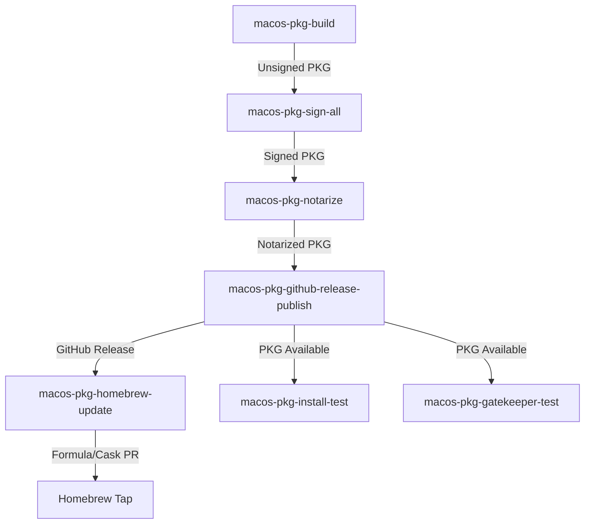

# Azure DevOps Setup Guide for Azure CLI macOS PKG Pipelines

> **Note**: This guide covers initial Azure DevOps setup. For detailed pipeline documentation, see [MACOS_PKG_PIPELINES.md](../MACOS_PKG_PIPELINES.md)

## Overview

This guide will help you set up Azure DevOps for the Azure CLI macOS PKG distribution pipeline system. The current implementation uses **Azure DevOps for the complete workflow**:

1. ✅ Build PKGs in Azure DevOps (`macos-pkg-build.yml`)
2. ✅ Sign all binaries + PKG using ESRP (`macos-pkg-sign-all.yml`)
3. ✅ Notarize with Apple via ESRP (`macos-pkg-notarize.yml`)
4. ✅ Publish to GitHub releases (`macos-pkg-github-release-publish.yml`)
5. ✅ Update Homebrew tap (`macos-pkg-homebrew-update.yml`)
6. ✅ Run installation tests (`macos-pkg-install-test.yml`, `macos-pkg-gatekeeper-test.yml`)

## Prerequisites

### 1. Azure DevOps Organization
- [ ] Access to an Azure DevOps organization
- [ ] Permissions to create pipelines and variable groups
- [ ] ESRP signing access (Microsoft internal requirement)

### 2. GitHub Integration
- [ ] GitHub Personal Access Token (PAT) with `repo` scope
- [ ] Access to your GitHub repository releases

### 3. Signing & Notarization Credentials
- [ ] Access to Microsoft ESRP signing service
- [ ] Variable group: `AME ESRP Variable Group` with ESRP credentials
  - `ESRPAppClientId`
  - `ESRPAppTenantId`
  - `ESRPKVName`
  - `ESRPSignCertName`

## Setup Steps

### Step 1: Create Variable Groups

#### A. GitHub Integration Variable Group

1. Go to Azure DevOps → Pipelines → Library
2. Click "+ Variable group"
3. Name: `github-integration`
4. Add variables:
   ```
   Variable Name: GITHUB_PAT
   Value: <your-github-personal-access-token>
   Secret: ✅ (check this box)
   ```

#### B. macOS Signing Variable Group

This should already exist in your organization if you have OneBranch access:
- Name: `mscodehub-macos-package-signing`
- Contains: `KeyCode` variable for macOS signing

If it doesn't exist, contact your OneBranch/ESRP administrator.

### Step 2: Configure Repository Access

The pipelines require access to:

1. **Main repository**: Your Azure CLI fork (e.g., `naga-nandyala/azure-cli-pkg-1`)
2. **Homebrew tap repository**: For formula/cask updates (e.g., `naga-nandyala/homebrew-mycli-app`)

Ensure you have appropriate permissions to both repositories.

### Step 3: Create the Pipelines

**Recommended: Start with the All-in-One Pipeline**

1. Go to Azure DevOps → Pipelines
2. Click "New pipeline"
3. Choose "GitHub" (or your source)
4. Select your repository
5. Choose "Existing Azure Pipelines YAML file"
6. **For complete workflow**: Path: `/.azure-pipelines/macos-pkg-release-complete.yml`
7. Click "Continue" and "Save" (don't run yet)

**Alternative: Create Individual Pipelines**

For modular control, create separate pipelines for:
- `macos-pkg-build.yml` - Build unsigned PKGs
- `macos-pkg-sign-all.yml` - Sign all binaries + PKG
- `macos-pkg-notarize.yml` - Notarize with Apple
- `macos-pkg-github-release-publish.yml` - Publish to GitHub
- `macos-pkg-homebrew-update.yml` - Update Homebrew tap
- `macos-pkg-install-test.yml` - Test installations
- `macos-pkg-gatekeeper-test.yml` - Security validation

See [MACOS_PKG_PIPELINES.md](../MACOS_PKG_PIPELINES.md) for detailed documentation on each pipeline.

### Step 4: Configure Pipeline Parameters

**For macos-pkg-release-complete.yml (Recommended):**

| Parameter | Example | Description |
|-----------|---------|-------------|
| `UnsignedBuildId` | `282071` | Build ID from macos-pkg-build (if using separate build) |
| `AzureCliVersion` | `2.0.0` | Version number |
| `BundleId` | `com.microsoft.azure.cli` | Bundle ID for signing/notarization |
| `GitHubRepo` | `naga-nandyala/azure-cli-pkg-1` | GitHub repository (owner/repo) |
| `HomebrewTapRepo` | `naga-nandyala/homebrew-mycli-app` | Homebrew tap repository |
| `OfficialBuild` | `true` | Enable ESRP signing (required) |
| `IsPreRelease` | `false` | Mark GitHub release as pre-release |

See individual pipeline files for specific parameters.

## Usage Workflow

### Complete End-to-End Process



**Or use the all-in-one pipeline:**
```
macos-pkg-release-complete.yml
  ├─ Build unsigned PKG
  ├─ Sign all binaries + PKG (ESRP)
  ├─ Notarize with Apple (ESRP)
  ├─ Publish to GitHub
  └─ Update Homebrew tap
```

### Step-by-Step Usage

See [MACOS_PKG_PIPELINES.md](../MACOS_PKG_PIPELINES.md) for detailed usage instructions for each pipeline.

## Pipeline Architecture

See [MACOS_PKG_PIPELINES.md](../MACOS_PKG_PIPELINES.md) for detailed pipeline architecture and flow documentation.

## Pipeline Files

```
.azure-pipelines/
├── macos-pkg-build.yml                    # Build pipeline
├── macos-pkg-sign-all.yml                 # Complete signing
├── macos-pkg-notarize.yml                 # Apple notarization
├── macos-pkg-github-release-publish.yml   # GitHub publishing
├── macos-pkg-homebrew-update.yml          # Homebrew tap updates
├── macos-pkg-install-test.yml             # Installation testing
├── macos-pkg-gatekeeper-test.yml          # Security validation
├── macos-pkg-release-complete.yml         # All-in-one pipeline
├── macos-pkg-sig-verify.yml               # Signature verification
├── macos-pkg-notarize-verify.yml          # Notarization verification
├── MACOS_PKG_PIPELINES.md                 # Complete documentation
└── docs/
    ├── AZURE-DEVOPS-SETUP.md              # This file
    └── SIGNING-PROCESS.md                 # Technical signing details
```

## Security Considerations

### Certificate Management
- ✅ Certificates stored in Azure Key Vault (via OneBranch)
- ✅ KeyCode variable marked as secret
- ✅ No certificates in source code
- ✅ Signing happens in isolated OneBranch environment

### GitHub Token
- ✅ PAT stored as secret variable
- ✅ Minimal permissions (repo read/write for releases)
- ✅ Consider using GitHub App instead of PAT for better security

### SDL (Security Development Lifecycle)
- ✅ SBOM generation enabled
- ✅ Credential scanning enabled
- ✅ Code signing validation enabled
- ⚠️ BinSkim disabled (not applicable to PKG files)

## Artifacts Produced

### Azure DevOps Artifacts
```
signed-macos-pkg/
├── azure-cli-2.76.0-macos-arm64-signed.pkg
├── azure-cli-2.76.0-macos-arm64-signed.pkg.sha256
├── azure-cli-2.76.0-macos-x86_64-signed.pkg
├── azure-cli-2.76.0-macos-x86_64-signed.pkg.sha256
├── signing-report-arm64.txt
└── signing-report-x86_64.txt
```

### GitHub Release Assets (if UploadToGitHub = true)
Same as above, uploaded to the original GitHub release.

## Testing

### Test on Non-Production Release

1. Create a test release in GitHub:
   ```bash
   gh release create azure-cli-pkg-v2.76.0-test \
     dist/macos_pkg/*.pkg \
     --prerelease \
     --title "Test Release for Signing"
   ```

2. Run signing pipeline with test parameters:
   - GitHubReleaseTag: `azure-cli-pkg-v2.76.0-test`
   - UploadToGitHub: `false` (download from Azure DevOps)

3. Manually verify signing:
   ```bash
   pkgutil --check-signature azure-cli-2.76.0-macos-arm64-signed.pkg
   ```

## Migration Path

### Current State
- ✅ Build in GitHub Actions
- ❌ No signing
- ✅ Publish to GitHub releases

### Phase 1 (Current)
- ✅ Build in GitHub Actions
- ✅ Sign in Azure DevOps (manual trigger)
- ✅ Publish signed PKGs to GitHub

### Phase 2 (Future)
- ⏭️ Build in Azure DevOps
- ✅ Sign in Azure DevOps (same pipeline)
- ✅ Publish to GitHub + Azure Artifacts

### Phase 3 (Long-term)
- ⏭️ Full OneBranch integration
- ✅ Coordinated build + package pipeline
- ✅ Automated release process

## Troubleshooting

### Common Issues

#### Issue: "ESRP credentials not found"
**Solution**: Ensure variable group `AME ESRP Variable Group` is linked to pipeline and contains required ESRP credentials.

#### Issue: "GitHub API rate limit exceeded"
**Solution**: Add GITHUB_PAT to `github-integration` variable group.

#### Issue: "ESRP signing task fails"
**Solution**: Verify ESRP credentials in `AME ESRP Variable Group` and ensure KeyCode `CP-401337-Apple` is valid.

#### Issue: "Signed PKG still shows as unsigned on macOS"
**Solution**: Ensure the notarization pipeline (`macos-pkg-notarize.yml`) completed successfully. Check that the PKG is stapled using `stapler validate`.

## Next Steps

1. ✅ Set up variable groups
2. ✅ Test signing pipeline with a test release
3. ✅ Verify signed PKG on macOS
4. ✅ Update Homebrew cask to use signed PKGs
5. 🔄 Plan migration to full Azure DevOps build

## Support

### Internal Resources (Microsoft)
- OneBranch Documentation: https://eng.ms/docs/onebranch
- ESRP Documentation: https://eng.ms/docs/esrp
- #onebranch on Teams

### External Resources
- Apple Code Signing: https://developer.apple.com/support/code-signing/
- Azure Pipelines YAML: https://docs.microsoft.com/azure/devops/pipelines/yaml-schema

## Version History

| Version | Date | Changes |
|---------|------|---------|
| 1.0 | 2025-01-11 | Initial setup for macOS PKG signing |
| 2.0 | 2025-12-04 | Updated for current ESRP-based pipeline architecture |
