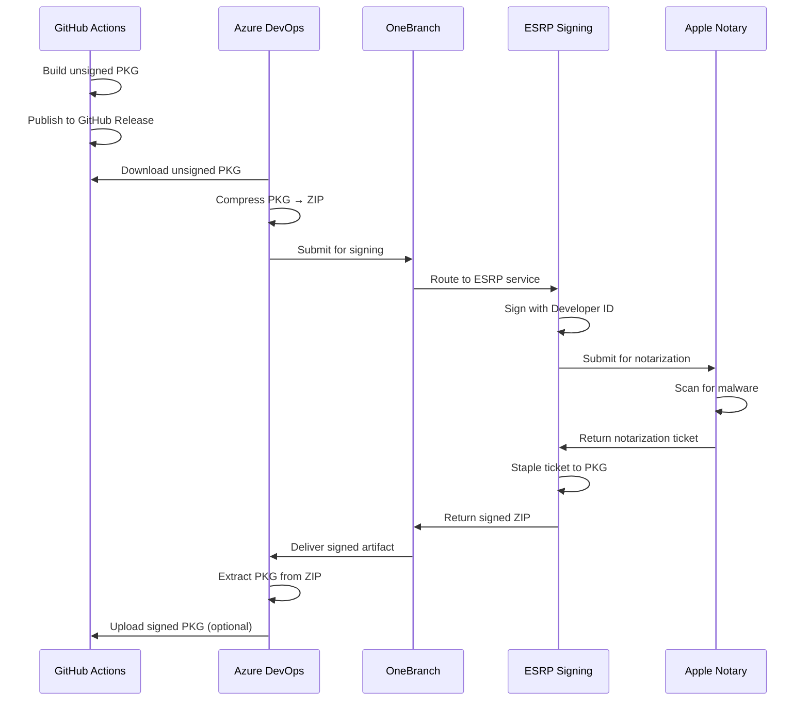

# Azure CLI macOS PKG Signing Process - Technical Details

## Overview

This document provides technical details about how the macOS PKG signing process works using Azure DevOps and OneBranch, based on PowerShell's proven implementation.

## Signing Architecture

### OneBranch MacAppDeveloperSign Operation

The `MacAppDeveloperSign` operation is ESRP's comprehensive macOS package signing service that handles:

1. ✅ **Code Signing** - Signs the PKG with Developer ID Installer certificate
2. ✅ **Notarization** - Submits to Apple's notarization service
3. ✅ **Stapling** - Attaches notarization ticket to PKG
4. ✅ **Hardening** - Enables runtime hardening for security

### Why ZIP Compression is Required

OneBranch's signing infrastructure requires macOS packages to be compressed into ZIP archives:

```powershell
# PowerShell pattern (from mac-package-build.yml)
Compress-Archive -Path $file -Destination $zipFile

# OneBranch signing
task: onebranch.pipeline.signing@1
files_to_sign: '**/*-osx-*.zip'  # Must be ZIP files
```

**Reason**: The signing service runs on Windows, but macOS PKG files need to be signed with Apple-specific tools. The ZIP format allows:
- Safe transport across platforms
- Preservation of macOS file attributes
- Batch processing of multiple files
- Consistent handling of binary formats

### Signing Flow Diagram



## Technical Implementation Details

### Stage 1: Download from GitHub

#### API Authentication
```powershell
# Unauthenticated (rate limited to 60 requests/hour)
$headers = @{
  'Accept' = 'application/vnd.github+json'
  'User-Agent' = 'AzureDevOps-Pipeline'
}

# Authenticated (5000 requests/hour)
$headers['Authorization'] = "Bearer $env:GITHUB_TOKEN"
```

#### Release Asset Discovery
```powershell
# Get release metadata
$apiUrl = "https://api.github.com/repos/$owner/$repo/releases/tags/$tag"
$release = Invoke-RestMethod -Uri $apiUrl -Headers $headers

# Find PKG assets
$pkgFiles = @(
  "azure-cli-$version-macos-arm64.pkg",
  "azure-cli-$version-macos-x86_64.pkg"
)

foreach ($pkgFile in $pkgFiles) {
  $asset = $release.assets | Where-Object { $_.name -eq $pkgFile }
  $downloadUrl = $asset.browser_download_url
  Invoke-WebRequest -Uri $downloadUrl -OutFile $outputPath
}
```

### Stage 2: Sign with OneBranch

#### File Preparation
```powershell
# Pattern from PowerShell's implementation
$pkgPath = "azure-cli-$version-macos-$arch.pkg"
$zipPath = "azure-cli-$version-macos-$arch.zip"

# Compress (OneBranch requirement)
Compress-Archive -Path $pkgPath -Destination $zipPath -CompressionLevel Optimal
```

#### OneBranch Signing Task
```yaml
- task: onebranch.pipeline.signing@1
  displayName: 'Sign macOS PKG using OneBranch'
  inputs:
    command: 'sign'
    files_to_sign: '**/*-macos-*.zip'
    search_root: '$(Pipeline.Workspace)/to-be-signed'
    inline_operation: |
      [
        {
          "KeyCode": "$(KeyCode)",
          "OperationCode": "MacAppDeveloperSign",
          "ToolName": "sign",
          "ToolVersion": "1.0",
          "Parameters": {
            "Hardening": "Enable",
            "OpusInfo": "http://www.microsoft.com"
          }
        }
      ]
```

#### Parameters Explained

| Parameter | Value | Purpose |
|-----------|-------|---------|
| `KeyCode` | `$(KeyCode)` | Certificate identifier from variable group |
| `OperationCode` | `MacAppDeveloperSign` | ESRP operation for macOS packages |
| `ToolName` | `sign` | Base signing tool |
| `ToolVersion` | `1.0` | Tool version |
| `Hardening` | `Enable` | Runtime hardening for security |
| `OpusInfo` | `http://www.microsoft.com` | Package publisher URL |

### Stage 3: Post-Signing Processing

#### Extraction and Verification
```powershell
# Extract signed PKG from ZIP
$signedZip = Get-ChildItem -Filter "*.zip"
Expand-Archive -Path $signedZip -DestinationPath $outputDir

# Rename to indicate signed status
$signedPkg = Get-ChildItem -Filter "*.pkg"
$newName = $signedPkg.Name -replace '\.pkg$', '-signed.pkg'
Move-Item $signedPkg -Destination $newName
```

#### Checksum Generation
```powershell
# Generate SHA256 (compatible with shasum -c)
$hash = Get-FileHash -Path $signedPkg -Algorithm SHA256
$content = "$($hash.Hash.ToLower())  $($signedPkg.Name)"
$content | Out-File -FilePath "$signedPkg.sha256" -Encoding ASCII
```

## Comparison with PowerShell's Implementation

### Similarities ✅

| Aspect | PowerShell | Azure CLI (This Implementation) |
|--------|-----------|----------------------------------|
| **Signing Task** | `onebranch.pipeline.signing@1` | ✅ Same |
| **Operation Code** | `MacAppDeveloperSign` | ✅ Same |
| **Hardening** | `Enable` | ✅ Same |
| **ZIP Compression** | ✅ Required | ✅ Required |
| **Windows Pool** | ✅ Signing on Windows | ✅ Same |
| **Two-Stage Pattern** | ✅ Build → Sign | ✅ Download → Sign |

### Differences ⚠️

| Aspect | PowerShell | Azure CLI (This Implementation) |
|--------|-----------|----------------------------------|
| **Build Stage** | OneBranch build on macOS | GitHub Actions |
| **Artifact Source** | Pipeline artifact | GitHub release download |
| **Variable Groups** | `mscodehub-macos-package-signing` | ✅ Same + `github-integration` |
| **Package Pipeline** | Separate coordinated pipeline | Integrated in signing pipeline |

## What MacAppDeveloperSign Does

Based on ESRP documentation and PowerShell's usage:

### 1. Developer ID Signing
```bash
# Equivalent macOS command
productsign --sign "Developer ID Installer: Microsoft Corporation (UBF8T346G9)" \
  unsigned.pkg \
  signed.pkg
```

### 2. Notarization
```bash
# Equivalent macOS commands
xcrun notarytool submit signed.pkg \
  --apple-id "your@email.com" \
  --password "app-specific-password" \
  --team-id "UBF8T346G9" \
  --wait
```

### 3. Stapling
```bash
# Equivalent macOS command
xcrun stapler staple signed.pkg
```

### 4. Hardening (when enabled)
- Enables runtime code signing
- Requires notarization
- Enforces Gatekeeper policies
- Prevents unsigned code injection

## Verification Process

### On Windows (Build Agent)

```powershell
# Can only verify file exists and size
$signedPkg = Get-ChildItem -Filter "*-signed.pkg"
if ($signedPkg.Length -lt 1MB) {
  Write-Error "Package too small - signing may have failed"
}
```

### On macOS (Manual Verification)

```bash
# Check signature
pkgutil --check-signature azure-cli-2.76.0-macos-arm64-signed.pkg

# Output should show:
# Status: signed by a developer certificate issued by Apple for distribution
# Signed with a trusted timestamp on: <date>
# Certificate Chain:
#   1. Developer ID Installer: Microsoft Corporation (UBF8T346G9)
#   2. Developer ID Certification Authority
#   3. Apple Root CA

# Verify notarization
spctl --assess --type install -v azure-cli-2.76.0-macos-arm64-signed.pkg

# Output should show:
# azure-cli-2.76.0-macos-arm64-signed.pkg: accepted
# source=Notarized Developer ID

# Check stapled ticket
stapler validate azure-cli-2.76.0-macos-arm64-signed.pkg

# Output should show:
# Processing: azure-cli-2.76.0-macos-arm64-signed.pkg
# The validate action worked!
```

## Security Benefits

### Before Signing
```bash
# User attempts to install unsigned PKG
sudo installer -pkg azure-cli.pkg -target /

# macOS shows:
# ⚠️  "azure-cli.pkg" cannot be opened because it is from an unidentified developer
# User must: System Preferences → Security → Allow anyway
```

### After Signing + Notarization
```bash
# User attempts to install signed PKG
sudo installer -pkg azure-cli-signed.pkg -target /

# macOS shows:
# ✅ Standard installation dialog
# No security warnings
# Smooth installation experience
```

### Hardening Benefits

With `Hardening: Enable`:
- ✅ Runtime code validation
- ✅ Library validation (prevents dylib injection)
- ✅ Secure timestamp (proves signing date)
- ✅ Future compatibility with macOS security updates

## Troubleshooting Signing Issues

### Issue: "Signing failed - ZIP not found"

**Cause**: OneBranch task couldn't find files to sign

**Solution**:
```yaml
# Verify search_root and pattern
- pwsh: |
    Get-ChildItem -Path "$(Pipeline.Workspace)/to-be-signed" -Recurse
```

### Issue: "Signed PKG appears unsigned on macOS"

**Cause**: Notarization can take 5-30 minutes

**Solution**: Wait for notarization to complete, then check:
```bash
# Check notarization status
xcrun notarytool history --apple-id <id> --password <pass> --team-id <team>
```

### Issue: "KeyCode variable not found"

**Cause**: Variable group not linked to pipeline

**Solution**:
1. Go to Pipeline → Edit
2. Click "..." → Triggers
3. Variables → Variable groups
4. Add `mscodehub-macos-package-signing`

### Issue: "OneBranch templates not accessible"

**Cause**: Missing repository permissions

**Solution**: Request access from OneBranch team or your Azure DevOps admin.

## Performance Considerations

### Timing Breakdown (Typical)

| Stage | Duration | Notes |
|-------|----------|-------|
| Download from GitHub | 30-60s | Depends on PKG size (~200MB each) |
| Compress to ZIP | 10-20s | Fast on Windows agents |
| OneBranch signing | 5-15 min | Includes notarization queue time |
| Extract and publish | 10-30s | Fast |
| **Total** | **6-17 min** | Most time in signing/notarization |

### Optimization Tips

1. **Parallel signing** - ARM64 and x86_64 sign in parallel
2. **Artifact caching** - Reuse downloads if re-running
3. **Skip GitHub upload** - Test locally first

## Cost Considerations

### Azure DevOps
- ✅ Windows agents: Included in Microsoft subscription
- ✅ OneBranch pipeline: Free for Microsoft teams
- ⚠️ Pipeline minutes: Monitor usage

### ESRP Signing
- ✅ Free for Microsoft official builds
- ⚠️ Quota limits may apply (contact ESRP team)

### Apple Developer
- ⚠️ Requires Apple Developer Program membership ($99/year)
- ✅ Notarization: Included with membership
- ✅ Unlimited submissions

## Best Practices

### Do ✅
- Test on pre-release tags first
- Verify signatures on macOS before production
- Keep variable groups secure
- Monitor pipeline run times
- Generate checksums for all artifacts
- Document certificate expiration dates

### Don't ❌
- Don't commit certificates to source control
- Don't skip notarization (users will get warnings)
- Don't use test certificates for production
- Don't disable hardening (reduces security)
- Don't share KeyCode variable values

## Future Enhancements

### Phase 1 (Current)
- ✅ Download from GitHub
- ✅ Sign with OneBranch
- ✅ Upload back to GitHub

### Phase 2 (Planned)
- 🔄 Build in Azure DevOps
- ✅ Sign in same pipeline
- 🔄 Coordinated build pattern (like PowerShell)

### Phase 3 (Future)
- 🔄 Full OneBranch integration
- 🔄 Automated certificate rotation
- 🔄 Multi-platform signing (Windows MSI, Linux RPM)

## References

### PowerShell Implementation
- `.pipelines/templates/mac-package-build.yml` - PKG signing template
- `.pipelines/templates/obp-file-signing.yml` - Binary signing template
- `tools/packaging/packaging.psm1` - Signing verification functions

### Microsoft Internal
- OneBranch Documentation: https://eng.ms/docs/onebranch
- ESRP Code Signing: https://eng.ms/docs/esrp
- MacAppDeveloperSign: https://eng.ms/docs/esrp/operations

### Apple Documentation
- Code Signing Guide: https://developer.apple.com/library/archive/documentation/Security/Conceptual/CodeSigningGuide/
- Notarization: https://developer.apple.com/documentation/security/notarizing_macos_software_before_distribution
- Gatekeeper: https://support.apple.com/guide/security/gatekeeper-sec5599b66df/web

---

**Document Version**: 1.0  
**Last Updated**: 2025-01-11  
**Maintained By**: Azure CLI Team  
**Based On**: PowerShell OneBranch implementation
